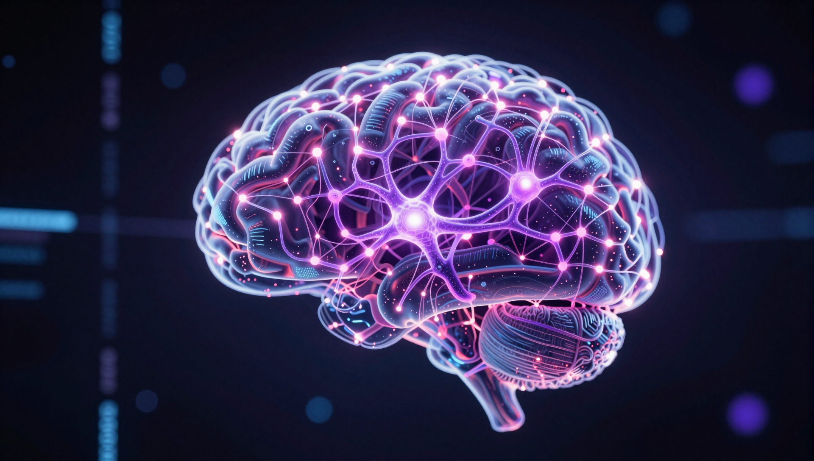

# Neural Memory Adapter for Hermes Agent

Semantic memory system with knowledge graph, spreading activation, embedding-based recall, **autonomous dream consolidation**, and **C++ LSTM+kNN pattern learning** for the Hermes Agent.

> **Day-0 testers: run the migration first!**
> The database growth fix + auto-retention patches landed. One command, zero data loss:
> ```bash
> cd ~/projects/neural-memory-adapter && bash migrate.sh
> ```
> Brings your install from PoC to production grade. Safe to re-run (idempotent).
> See [Migration](#migration) for details.


[](https://github.com/user-attachments/assets/2d938624-cc39-4f8b-b35b-485b23e93355)

## Features

- **Semantic Memory Storage**: Store memories with automatic embedding generation (`BAAI/bge-m3`, 1024d, CUDA-accelerated)
- **Knowledge Graph**: Automatic connection of related memories based on cosine similarity
- **Spreading Activation**: Explore connected ideas through BFS graph traversal with decay
- **Conflict Detection**: Automatically detect and supersede conflicting memories
- **Dream Engine**: Autonomous background consolidation (NREM/REM/Insight phases)
- **LSTM+kNN Pattern Learning**: C++ LSTM predicts next-relevant embedding from access sequences; kNN re-ranks by multi-signal score (embedding + temporal + frequency + graph)
- **MSSQL Backend**: Optional shared database for multi-agent setups — all dream operations write to the `connections` table directly
- **CUDA Acceleration**: GPU-accelerated embeddings via sentence-transformers

## Installation

```bash
cd ~/projects/neural-memory-adapter
bash install_database.sh   # Setup database
bash install.sh            # Install plugin
```

### Installation Modes

| Mode | Command | RAM | Backend | Embeddings |
|------|---------|-----|---------|------------|
| **Lite** | `bash install.sh --lite` | ~50MB | SQLite | hash/tfidf (auto) |
| **Full Stack** | `bash install.sh --full` | ~500MB | SQLite + MSSQL | bge-m3 1024d + C++ LSTM+kNN |

**Lite** — Budget VPS friendly. No GPU, no Docker, no external services. Perfect for small setups.

**Full Stack** — Production. MSSQL shared database, sentence-transformers embeddings, optional GPU, C++ LSTM+kNN pattern learning. Supports multi-agent dream consolidation.

The installer will:
1. Check/install Python dependencies
2. Build the C++ library (optional)
3. Create databases (SQLite + optionally MSSQL)
4. Install the Hermes plugin
5. Configure Hermes

### Prerequisites for Full Stack

- MSSQL Server running (`sudo systemctl start mssql-server`)
- ODBC Driver 18 (`yay -S msodbcsql18`)
- `pyodbc` (`pip install pyodbc`)
- C++ build: `cmake`, C++17 compiler

## Migration

If you installed Neural Memory **before 2026-04-16**, run the migration once to fix database growth issues and enable auto-retention:

```bash
cd ~/projects/neural-memory-adapter
git pull
bash migrate.sh
```

### What it does

| Step | Action | Why |
|------|--------|-----|
| 1 | Backup database | Safety net — `memory.db.bak.<timestamp>` |
| 2 | Clean orphans | Remove connections pointing to deleted memories |
| 3 | Clean history bloat | Remove changelog entries for deleted memories |
| 4 | Deduplicate edges | Merge duplicate (source, target, type) triples |
| 5 | UNIQUE constraint | Prevent future duplicate edges at DB level |
| 6 | Retention indexes | Fast time-based cleanup queries |
| 7 | VACUUM | Reclaim wasted disk space |
| 8 | Patch dream_engine.py | Auto-prune every 50 Dream cycles (history 7d, sessions 30d, orphans) |
| 9 | Patch backends | MSSQL + C++ backend retention methods |
| 10 | Verify integrity | Full sanity check |

### Typical results

```
Before:  200-400 MB (depending on age)
After:   30-80 MB
Saved:   60-80% disk space
```

### Safety

- **Backup always created** before any changes
- **Idempotent** — safe to re-run, skips what's already clean
- **`--dry-run`** — preview without changes: `bash migrate.sh --dry-run`
- **Integrity verified** after every run

### After migration

The Dream Engine will now automatically prune old data every 50 cycles. No manual maintenance needed going forward. If your database still grows faster than expected, check `connection_history` row count:

```bash
sqlite3 ~/.neural_memory/memory.db "SELECT COUNT(*) FROM connection_history"
```

Should stay under 500K in normal operation.

## Configuration

### Config (`config.yaml`) — Single Source of Truth

All settings — including MSSQL credentials — live in `~/.hermes/config.yaml`.
No `.env` vars needed. The plugin reads config.yaml and sets C++ bridge env vars internally.

```yaml
memory:
  provider: neural
  neural:
    db_path: ~/.neural_memory/memory.db
    embedding_backend: sentence-transformers  # or: auto
    prefetch_limit: 10
    search_limit: 10
    dream:
      enabled: true
      idle_threshold: 600        # seconds before dream cycle
      memory_threshold: 50       # dream after N new memories
      mssql:                     # MSSQL backend config
        server: 127.0.0.1
        database: NeuralMemory
        username: SA
        password: 'your_password_here'
        driver: '{ODBC Driver 18 for SQL Server}'
```

**How it works:**
1. Plugin loads `config.yaml` via `config.py`
2. Reads `memory.neural.dream.mssql.*` settings
3. Sets `MSSQL_SERVER`, `MSSQL_DATABASE`, `MSSQL_USERNAME`, `MSSQL_PASSWORD`, `MSSQL_DRIVER` into `os.environ`
4. C++ bridge picks them up via `std::getenv()` — no `.env` file needed

## Tools

When active, the following tools are available:

| Tool | Description |
|------|-------------|
| `neural_remember` | Store a memory (with conflict detection) |
| `neural_recall` | Search memories by semantic similarity |
| `neural_think` | Spreading activation from a memory |
| `neural_graph` | View knowledge graph statistics |
| `neural_dream` | Force a dream cycle (all/nrem/rem/insight) |
| `neural_dream_stats` | Dream engine statistics |

## Dream Engine

Autonomous background memory consolidation inspired by biological sleep:

**Phase 1 — NREM (Replay & Consolidation)**
Replays 100 recent memories via spreading activation. Active connections strengthened (+0.05), inactive weakened (-0.01 with decay protection for strong/bridge edges). Dead connections pruned (<0.05).

**Phase 2 — REM (Exploration & Bridge Discovery)**
Finds 50 isolated memories (few connections). For each, searches for semantically similar unconnected memories via `recall()`. Creates tentative bridge connections in the `connections` table (weight = similarity × 0.3).

**Phase 3 — Insight (Community Detection)**
BFS connected component analysis on the full graph. Identifies bridge nodes spanning multiple communities. Creates cluster and bridge insight entries in `dream_insights`.

### Triggers

- Automatic: after 600s idle (configurable)
- Automatic: every 50 new memories (configurable)
- Manual: `neural_dream` tool
- Cron: every 6 hours (default)

### Standalone Worker

```bash
# One-shot cycle
python python/dream_worker.py

# Specific phase
python python/dream_worker.py --phase nrem

# Daemon mode
python python/dream_worker.py --daemon --idle 300
```

## C++ LSTM+kNN Stack

The LSTM+kNN system learns *when* you'll need memories, not just *what* you'll need. It runs entirely in C++ via `libneural_memory.so`, with Python bindings through ctypes.

### Components

```
AccessLogger (Python)
  └─ logs every recall event (query embedding, result IDs, scores, timestamps)
  └─ circular buffer → JSON Lines persistence → co-occurrence analysis
  └─ extracts training pairs (sequence → target embedding)

LSTMPredictor (C++, 875 lines)
  └─ single-layer LSTM, Xavier-initialized
  └─ forward(): given sequence of recent access embeddings → predicted next embedding
  └─ train(): backprop on (sequence, target) pairs from AccessLogger
  └─ save/load weights to ~/.neural_memory/lstm_weights.bin

KNNEngine (C++, 281 lines)
  └─ multi-signal re-ranking of base recall results
  └─ score = w_embed × cosine + w_temporal × decay + w_freq × log(count) + w_graph × hop_distance
  └─ LSTM context dynamically adjusts weights (e.g., boost temporal if LSTM predicts time-sensitive query)
```

### How It Works

```
User query: "what pet do I have?"
    │
    ▼
1. Base recall (embedding search) → [memory#42: "dog named Lou", memory#88: "cat food"]
2. AccessLogger → recent sequence: [memory#17, memory#3, memory#42]
3. LSTMPredictor → predicts next embedding from sequence (what comes next?)
4. KNNEngine → re-ranks base results using 4 signals:
   - Embedding similarity (0.50 weight)
   - Temporal decay (0.20) — how recently was it accessed?
   - Frequency (0.15) — how often is it accessed?
   - Graph proximity (0.15) — how close in the knowledge graph?
5. LSTM context adjusts weights → final scored results
```

### Configuration

LSTM+kNN auto-initializes when `libneural_memory.so` is available. Falls back silently if not compiled.

| Parameter | Default | Description |
|-----------|---------|-------------|
| `input_dim` | 1024 | Embedding dimension (matches bge-m3) |
| `hidden_dim` | 256 | LSTM hidden state size |
| `w_embedding` | 0.50 | Cosine similarity weight |
| `w_temporal` | 0.20 | Temporal decay weight |
| `w_frequency` | 0.15 | Access frequency weight |
| `w_graph` | 0.15 | Graph proximity weight |
| `half_life_hours` | 24.0 | Temporal decay half-life |

## Architecture

### Data Flow (MSSQL Mode)

When MSSQL is configured, the system uses the `connections` table as single source of truth for all graph operations:

| Operation | Source | Notes |
|-----------|--------|-------|
| **Semantic search** (`recall`) | Python → MSSQL/SQLite | bge-m3 embedding similarity |
| **Spreading activation** (`think`) | Python → MSSQL `connections` | BFS with decay |
| **Dream NREM** strengthen/weaken/prune | pyodbc → MSSQL `connections` | Direct SQL UPDATE/DELETE |
| **Dream REM** bridge creation | pyodbc → MSSQL `connections` | INSERT with `edge_type = 'bridge'` |
| **Dream Insight** community detection | pyodbc → MSSQL `connections` | BFS connected components |
| **LSTM+kNN enhancement** | C++ → Python | In-memory scoring |
| **Session tracking** | SQLite `dream_sessions.db` | Lightweight metadata |

### Python Components

- `neural_memory.py`: Unified `Memory` class (auto-detects MSSQL vs SQLite, LSTM+kNN integration)
- `memory_client.py`: `NeuralMemory` class (remember/recall/think/graph) + `SQLiteStore`
- `embed_provider.py`: Embedding backends (sentence-transformers, tfidf, hash)
- `dream_engine.py`: Dream engine core + `SQLiteDreamBackend`
- `cpp_dream_backend.py`: MSSQL direct-query dream backend (pyodbc)
- `dream_mssql_store.py`: MSSQL dream session tracking
- `access_logger.py`: Recall event logging for LSTM training
- `lstm_knn_bridge.py`: Python ctypes interface to C++ LSTM+kNN

### C++ Components

- `libneural_memory.so`: Main shared library
  - `lstm.cpp` (875 lines): LSTM forward/backward pass, Xavier init, weight save/load
  - `knn.cpp` (281 lines): Multi-signal kNN scoring engine
  - `c_api.cpp`: C API surface (handles, type-safe wrappers)
  - `hopfield.cpp`: Hopfield network for pattern completion
  - `knowledge_graph.cpp`: Graph operations

## Testing

```bash
cd ~/projects/neural-memory-adapter/python
python3 demo.py
```

## File Structure

```
neural-memory-adapter/
├── migrate.sh                    # One-shot Day-0 → Production migration
├── install.sh                    # Plugin installer (Lite/Full picker)
├── install_database.sh           # Database setup (SQLite/MSSQL)
├── hermes-plugin/                # Plugin files (deployed to Hermes)
│   ├── __init__.py               # MemoryProvider + tools
│   ├── config.py                 # Configuration loader
│   ├── plugin.yaml               # Plugin metadata
│   ├── neural_memory.py          # Unified Memory class
│   ├── memory_client.py          # Main client
│   ├── embed_provider.py         # Embedding backends
│   ├── dream_engine.py           # Dream engine (SQLite backend)
│   ├── cpp_dream_backend.py      # Dream engine (MSSQL direct queries)
│   ├── dream_mssql_store.py      # Dream engine (MSSQL sessions)
│   ├── mssql_store.py            # MSSQL storage backend
│   ├── access_logger.py          # Recall event logger (LSTM training data)
│   ├── lstm_knn_bridge.py        # C++ LSTM+kNN ctypes bridge
│   ├── cpp_bridge.py             # C++ vector ops ctypes bridge
│   └── fast_ops.pyx              # Cython cosine similarity
├── python/                       # Python source (source of truth)
│   └── (mirrors hermes-plugin/ + demo.py, dream_worker.py)
├── src/                          # C++ source
│   ├── core/c_api.cpp            # C API surface
│   ├── memory/lstm.cpp           # LSTM predictor
│   ├── memory/knn.cpp            # kNN engine
│   └── memory/hopfield.cpp       # Hopfield network
├── include/neural/               # C++ headers
│   ├── lstm.h                    # LSTM weights, forward pass, backprop
│   ├── knn.h                     # kNN config, multi-signal scoring
│   └── c_api.h                   # C API declarations
├── tools/
│   ├── production_upgrade.py       # DB cleanup script (orphans, dedup, VACUUM)
│   └── dashboard/                  # Interactive HTML dashboard
└── README.md
```

## Memory Storage

- **Database**: SQLite at `~/.neural_memory/memory.db` (always active)
- **MSSQL**: `localhost/NeuralMemory` (Full Stack, `connections` table as primary)
- **Embeddings**: `BAAI/bge-m3` (1024d) — auto-downloaded on first use, cached at `~/.neural_memory/models/` (~2.2 GB)
- **LSTM weights**: `~/.neural_memory/lstm_weights.bin` (persisted after training)
- **Access logs**: `~/.neural_memory/access_logs/` (JSON Lines, LSTM training data)

### Embedding Auto-Setup

| Priority | Backend | Model | Dimensions | Requirements |
|----------|---------|-------|------------|--------------|
| 1st | sentence-transformers | BAAI/bge-m3 | 1024 | GPU recommended, auto-downloads |
| 2nd | tfidf | — | varies | `numpy` only |
| 3rd | hash | — | 384 | nothing (always works) |

## Conflict Detection

When storing a memory with similar content to an existing one:
- High similarity (>0.7) + different content → updates existing memory
- Marks old memory as `[SUPERSEDED]` and adds `[UPDATED TO]`
- Returns the existing memory ID instead of creating duplicate

## Dashboard

Interactive HTML dashboard with knowledge graph visualization, category breakdowns, and connection analysis.

```bash
python tools/dashboard/generate.py                                    # SQLite
python tools/dashboard/generate.py --mssql --mssql-password 'pass'    # MSSQL
```

## Troubleshooting

### Plugin not loading

```bash
grep -n "def tool_error" ~/.hermes/hermes-agent/tools/registry.py
```

### Dependencies

```bash
# Lite
pip install numpy

# Full Stack
pip install sentence-transformers pyodbc numpy cython
```

### Database issues

```bash
rm ~/.neural_memory/memory.db  # fresh start
```

### MSSQL connection

```bash
grep -A5 'mssql:' ~/.hermes/config.yaml
systemctl status mssql-server
ss -tlnp | grep 1433
```

### C++ / LSTM+kNN

```bash
# Build
cd ~/projects/neural-memory-adapter/build
cmake .. -DCMAKE_BUILD_TYPE=Release
make neural_memory -j$(nproc)

# Verify
python3 -c "from lstm_knn_bridge import LSTMPredictor; print('OK')"
```

## License

See LICENSE file.
