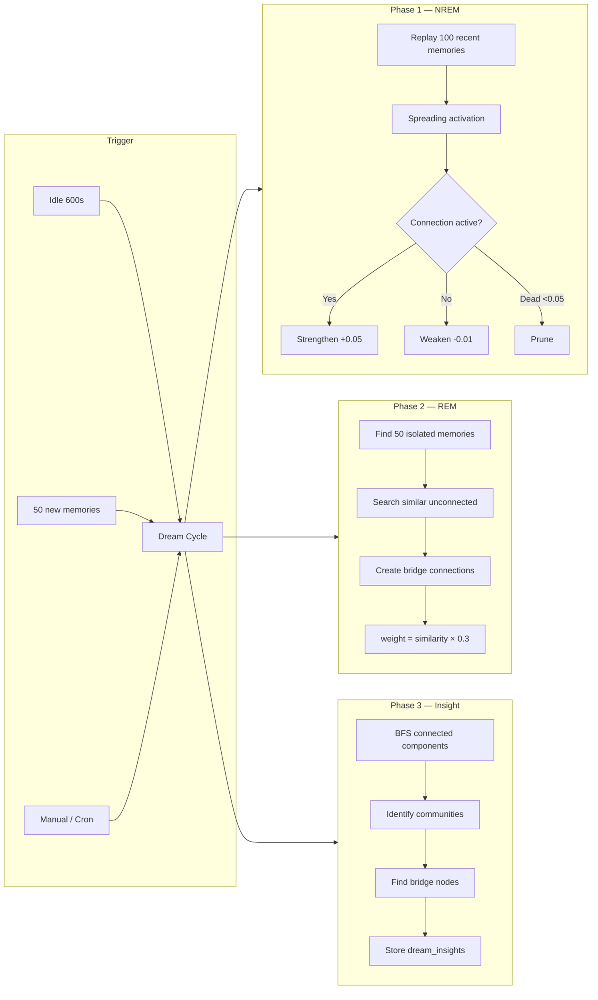

# Neural Memory Adapter for Hermes Agent

Semantic memory system with knowledge graph, spreading activation, embedding-based recall, autonomous dream consolidation, and GPU-accelerated recall for the Hermes Agent.

<video src="https://github.com/itsXactlY/neural-memory/raw/refs/heads/master/assets/cover_video.mp4" controls width="100%"></video>

[](https://raw.githubusercontent.com/itsXactlY/neural-memory/refs/heads/master/assets/neural_memory.png)

## Features

- **Semantic Memory Storage**: Store memories with auto embedding (FastEmbed ONNX, 1024d)
- **Knowledge Graph**: Auto-connect related memories via cosine similarity
- **Spreading Activation**: Explore connected ideas (BFS graph traversal with decay)
- **Conflict Detection**: Detect and supersede conflicting memories
- **Dream Engine**: Autonomous consolidation (NREM/REM/Insight phases)
- **GPU Recall**: CUDA-accelerated cosine similarity (~100ms, torch.matmul)
- **SQLite-First**: Always works, no external DB needed
- **MSSQL Optional**: Shared DB for multi-agent setups

## Quick Start

```bash
cd ~/projects/neural-memory-adapter
bash install.sh          # auto-detect hermes-agent
bash install.sh /path    # explicit path
```

The installer handles everything:
1. Python deps (FastEmbed, torch, numpy)
2. CUDA detection for GPU recall
3. Plugin deployment to hermes-agent
4. Database init (SQLite at ~/.neural_memory/memory.db)
5. config.yaml setup

Restart hermes after install: `hermes gateway restart`

## Architecture

### Embedding Backends (auto-priority)

| Priority | Backend | Model | Speed | Requirements |
|----------|---------|-------|-------|--------------|
| 1st | FastEmbed | intfloat/multilingual-e5-large | ~50ms | `pip install fastembed` |
| 2nd | sentence-transformers | BAAI/bge-m3 1024d | ~200ms | GPU recommended |
| 3rd | tfidf | — | varies | numpy only |
| 4th | hash | — | instant | nothing |

FastEmbed uses ONNX runtime — no PyTorch conflict, works on CPU. Falls back automatically.

### GPU Recall Engine

```python
# gpu_recall.py — CUDA cosine similarity
# Loads all embeddings into GPU, does torch.matmul for batch similarity
# ~100ms for 10K memories vs ~500ms CPU

from gpu_recall import GPURecall
engine = GPURecall()
results = engine.recall(query_embedding, all_embeddings, top_k=10)
```

Auto-detects CUDA. Falls back to Python/numpy if no GPU.

### Data Flow

```mermaid
flowchart TD
    subgraph Store["neural_remember"]
        A[User content] --> B[FastEmbed encode]
        B --> C[1024d vector]
        C --> D[SQLite INSERT]
        C --> E[Cosine similarity search]
        E --> F[Create connections]
    end

    subgraph Recall["neural_recall"]
        G[User query] --> H[FastEmbed encode]
        H --> I{CUDA available?}
        I -->|Yes| J[GPU torch.matmul]
        I -->|No| K[CPU numpy dot]
        J --> L[Top-k results]
        K --> L
    end

    subgraph Think["neural_think"]
        M[Source memory] --> N[BFS on connections]
        N --> O[Apply decay factor]
        O --> P[Ranked activation]
    end

    subgraph Dream["neural_dream"]
        Q[Idle trigger] --> R[NREM replay]
        R --> S[REM bridge discovery]
        S --> T[Insight communities]
        T --> U[Consolidated graph]
    end
```



### Storage

- **SQLite (always)**: `~/.neural_memory/memory.db` — source of truth
- **Embeddings cache**: `~/.neural_memory/models/` (auto-downloaded, ~2.2 GB)
- **GPU cache**: `~/.neural_memory/gpu_cache/` (embeddings.npy + metadata.pkl)
- **Access logs**: `~/.neural_memory/access_logs/` (JSON Lines)
- **MSSQL (optional)**: 127.0.0.1/NeuralMemory — multi-agent mirror

### SQLite Schema

```sql
-- Core tables
memories (id, content, embedding, category, salience, ...)
connections (source_id, target_id, weight, edge_type)
connection_history (source_id, target_id, last_weight, last_updated)

-- Dream engine
dream_sessions (id, phase, started_at, completed_at, stats)
dream_insights (id, session_id, type, data)

-- Indexes
idx_memories_category ON memories(category)
idx_connections_source ON connections(source_id)
idx_connections_target ON connections(target_id)
```

## Configuration

All settings in `~/.hermes/config.yaml`:

```yaml
memory:
  provider: neural
  neural:
    db_path: ~/.neural_memory/memory.db
    embedding_backend: fastembed       # auto | fastembed | sentence-transformers | tfidf | hash
    prefetch_limit: 10
    search_limit: 10
    dream:
      enabled: true
      idle_threshold: 600              # seconds before dream cycle
      memory_threshold: 50             # dream after N new memories
      mssql:                           # optional — only if using MSSQL
        server: 127.0.0.1
        database: NeuralMemory
        username: SA
        password: 'your_password'
        driver: '{ODBC Driver 18 for SQL Server}'
```

## Tools

When active, these tools are available in Hermes:

| Tool | Description |
|------|-------------|
| `neural_remember` | Store a memory (with conflict detection) |
| `neural_recall` | Search memories by semantic similarity |
| `neural_think` | Spreading activation from a memory |
| `neural_graph` | View knowledge graph statistics |
| `neural_dream` | Force a dream cycle (all/nrem/rem/insight) |
| `neural_dream_stats` | Dream engine statistics |

## Dream Engine

Autonomous background memory consolidation (biological sleep inspired):



### Triggers

- Automatic: after 600s idle (configurable)
- Automatic: every 50 new memories (configurable)
- Manual: `neural_dream` tool
- Standalone: `python python/dream_worker.py --daemon`

## Testing

```bash
# Quick smoke test
cd ~/projects/neural-memory-adapter/python
python3 demo.py

# From plugin dir
cd ~/.hermes/hermes-agent/plugins/memory/neural
python3 test_suite.py
```

## File Structure

```
neural-memory-adapter/
├── install.sh                    # Installer
├── hermes-plugin/                # Plugin (deployed to hermes-agent)
│   ├── __init__.py               # MemoryProvider + tools
│   ├── config.py                 # Config loader
│   ├── plugin.yaml               # Plugin metadata
│   ├── neural_memory.py          # Unified Memory class
│   ├── memory_client.py          # Main client (NeuralMemory, SQLiteStore)
│   ├── embed_provider.py         # Embedding backends (FastEmbed, st, tfidf, hash)
│   ├── gpu_recall.py             # CUDA cosine similarity engine
│   ├── dream_engine.py           # Dream engine (NREM/REM/Insight)
│   ├── dream_worker.py           # Standalone daemon
│   ├── access_logger.py          # Recall event logger
│   └── ...
├── python/                       # Python source (mirrors hermes-plugin)
│   └── ...
├── src/                          # C++ source (optional, legacy)
│   ├── memory/lstm.cpp           # LSTM predictor
│   ├── memory/knn.cpp            # kNN engine
│   └── memory/hopfield.cpp       # Hopfield network
└── README.md
```

## Lessons Learned (Production)

- **FastEmbed > sentence-transformers** — ONNX, no PyTorch conflict, fast on CPU
- **GPU recall > C++ Bridge** — C++ Hopfield was biased, GPU matmul is clean
- **SQLite = Source of Truth** — MSSQL optional, SQLite always works
- **Raw embeddings + GPU matmul** — best recall performance
- **Auto-detect everything** — CUDA, backends, venv paths
- **Don't force PyTorch** — let FastEmbed handle CPU, torch only for GPU recall
